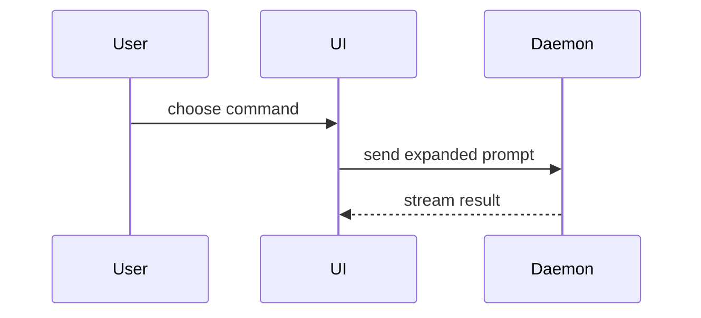

# Explain

Help the user understand the system. Investigate read-only; keep design critique and fixes to requested assessments.

## Sources

Read [Evidence](references/evidence.md) for sources to consider. Choose what could answer the question and follow useful leads. Check relevant connected sources when code leaves questions about requirements, decisions, or production behavior. Do not search every source by default.

- **Mechanics:** code, tests, configuration, and runtime evidence.
- **Rationale:** Git history, Logbook records, tickets, discussions, and design records. Do not infer the author's reasons from code alone.
- **Recap:** the diff against a stated baseline, including relevant uncommitted work, plus records explaining the changes.

## Optional review

Investigate directly by default. Consult another model when independent research or judgment would help, using `consultant_default` through [model configuration](../setup-mstack/references/runtime-resolution.md) and its runner. Give it a focused question and relevant context; check its evidence before using the answer.

Use [Interrogate](../interrogate/SKILL.md) for requested adversarial or multi-model critique. Include the subsystem or design, its requirements, and existing findings.

## Response template

Use these four headings in order unless the user requests another format. Skip the preamble and keep prose brief. Do not invent content to fill sections. Cite sources inline. Internal callers can reuse findings without a separate user-facing response.

### Summary

Answer the question. State the scope or comparison baseline.

### Walkthrough

Explain how it works, why it was chosen, or what changed.

Help the user understand the current topic of conversation visually. Skip the preamble and keep prose brief. Pick the smallest view that makes the key point clear.

- Show logic or an algorithm as pseudocode:

```text
on(save)
  if content is unchanged
    return cached result
  write new content
  return fresh result
```

- Show runtime control flow as a call tree:

```text
submitForm
  createSession
    persistPrompt
    launchAgent
  navigateToSession
```

- Show UI structure as a component tree, including state and module boundaries that matter:

```tsx
<SessionPage> (apps/example/src/routes/session.tsx)
  useSessionEvents()
  <SessionToolbar>
    <RunSkillButton> (packages/ui)
```

- Show file responsibility or a broad refactor as a shallow file tree:

```text
src/
├── commands/       # parses user actions
├── sessions/       # owns session state
└── transport/      # sends API requests
```

- Show component interaction, control flow, or data flow with Mermaid:



- Use `diff` when the point is what changes and the surrounding shape already exists. Match the diff shape to the topic.

For a component change:

```diff
 <SessionPage>
   useSessionEvents()
   <SessionToolbar>
+    <RunSkillButton />
   <SessionTimeline>
+    <SkillResultCard />
```

For a file-layout change:

```diff
 src/
 ├── commands/
+│   └── show-me.ts       # expands the slash command
 ├── sessions/
-└── transport.ts
+└── transport/
+    ├── client.ts
+    └── stream.ts
```

For a call-tree or call-stack change:

```diff
 submitForm
   createSession
     persistPrompt
+    expandSkillMention
     launchAgent
-  navigateToSession
+  navigateToSession
+    subscribeToEvents
```

For a state or control-flow change:

```diff
 on(save)
-  write content
+  if content is unchanged
+    return cached result
+  write new content
+  invalidate cache
```

- Show the whole block when most of it is new, when omitted context would hide ownership or order, or when the user needs a copyable target shape:

```ts
function expandSkill(command: string): string {
  const skillName = command.slice(1)
  return `use the ${skillName} skill`
}
```

- For a visual UI, layout, state comparison, or concept too dense for Mermaid, write one focused HTML file — a diagram, an infographic, or a short slide deck, whichever fits the point. Match the product's colors, type, spacing, and components; use real labels and data; support desktop and mobile. Save it as `explain-{description}.html` and open it for the user with the available preview tool or system file opener.

#### Visual guidance

Place each visual next to the short text it supports. Keep only the calls, files, props, states, and boundaries needed to answer the user's current question or the options to resolve the current discussion point.

You may use one of these, you may use several, it is unlikely you will use all of them. Use your judgement and don't overwhelm the user.

### Implications

Explain consequences relevant to the question. State any assumptions behind risks or design judgments. Before implementation, identify constraints to preserve.

### Evidence and limits

Link the most useful files and records. Identify inferred reasons, conflicting evidence, unanswered questions, and relevant sources you could not check.
